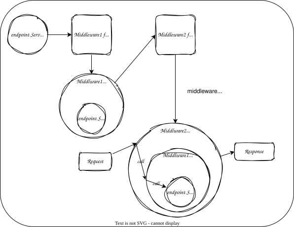

最近我在尝试使用 Actix-web 实现一个 Web 服务，其中涉及到了 JWT 鉴权的实现。为此，我想实现一个 `middleware` 来对请求进行前置处理。
但是，在 Actix-web 中实现一个中间件要比 JavaScript 和 Java 的 Web 框架复杂得多。在这里，我记录一下实现的过程和自己的理解。

<!-- truncate -->

中间件在 Web 服务中起到了非常重要的作用。它可以对请求进行预处理，例如身份验证和缓存，也可以对响应进行后置处理，例如响应压缩。
通过将 Web 服务中的一些通用功能提取成中间件，我们可以提高服务的重用性和可扩展性。这样，开发人员就能更专注于业务逻辑的实现。

一个 [`next.js`](https://nextjs.org/) 的中间件通常是一个简单的函数，
它能够获取到 request 的内容并执行异步处理。然后，它可以通过 NextResponse 来重定向请求，或者直接返回一个 Response。下面是一个简单的例子。

```ts {4-6} title="middleware.ts"
import { NextResponse } from 'next/server';
import type { NextRequest } from 'next/server';

export function middleware(request: NextRequest) {
  return NextResponse.redirect(new URL('/about-2', request.url));
}
```

在 Actix-web 中，有三种实现中间件的方式。

## 1. App::wrap_fn

第一种方式与 next.js 的中间件类似，可以使用一个函数来实现中间件。下面是官方文档中的一个示例：

```rust title="main.rs"
#[actix_web::main]
async fn main() {
    let app = App::new()
        .wrap_fn(|req, srv| {
            println!("Hi from start. You requested: {}", req.path());
            srv.call(req).map(|res| {
                println!("Hi from response");
                res
            })
        });
}
```

这种方式实现中间件比较简单，但是也有一个缺点：

`warp_fn` 是 `App` 特有的方法，也就是说这种中间件的作用范围是整个 `App`，无法设定中间件作用于哪些路由。

当然，你也可以在中间件中对路由进行过滤，但是从软件工程的角度来看，这样的设计不符合单一职责原则。路由信息应该在 Application 层控制，
而中间件的主要职责则是处理 HTTP 的请求和响应。

## 2. trait Service & trait Transform

第二种方式是通过实现 `Transform` 和 `Service` 这两个 `trait` 来实现中间件，**中间件就是一种特殊的 `Service`**, 官方提供的一些中间件也都是通过这种方式实现的。
我也是通过这种方式实现的，因此着重介绍一下这种实现方法。

使用这种方法创建中间件，当新的路由被添加后，也不需要修改中间件的代码；中间件的代码也更具有普适性。如果设计得当，可以将中间件抽离成库，在不同的项目中使用。

:::note
`Transform` 和 `Service` 的定义在不同版本的 Actix-web 中有一些区别，后面的介绍都是基于 Actix-web 4.0 版本。
:::

### Service 和 Tranform 的关系

`Service` 定义了一个异步的、将请求转化成响应的操作。在 Actix-web4 中，请求和响应可以是任何类型。在中间件的实现中，
通常使用 `ServiceRequest` 和 `ServiceResponse` 作为请求和响应类型。`Transform` 则定义了服务工厂的接口，该工厂在构建过程中包装内部服务。

因此，在 actix-web 中间件中，`Service` 扮演的角色类似于上面 `next.js` 中的 `RequestHandler`，用于处理请求并返回响应。
而 `Transform` 则类似于 `Service` 的工厂，通常将前置 `Service` 作为参数传递给 `Transform`。

下面是我理解的 `Transform` 和 `Service` 的关系图，`Transform` 接受 `Service` 作为参数并生成 `middleware`，
多个 `Transform` 链式调用则会生成一个嵌套的 `Service`。

<div className="text-center">



</div>

每一层的中间件都相当于是一个 `Service`，在服务端接收到请求后，请求会先被最外层的中间件处理。
每一层的中间件都可以决定是否要调用内层 `Service` 的 `call` 方法，或者直接在这一层返回 `Response`。
中间件也可以在调用 `call` 方法的前后进行对请求的前置处理和后置处理。

### trait Transform

下面是 `trait Transform` 的定义，详细介绍请参阅[官方文档](https://docs.rs/actix-web/4.3.1/actix_web/dev/trait.Transform.html)

```rust

/// S：前置Service
/// Req：请求类型
/// 下面注释中提到的“生成的Service”就是中间件
pub trait Transform<S, Req> {
    /// 生成的 Service 的响应类型
    type Response;

    /// 生成的 Service 的错误类型
    type Error;

    /// 生成的 Service 的类型
    type Transform: Service<Req, Response = Self::Response, Error = Self::Error>;

    /// 生成 Service 过程的错误类型
    type InitError;

    /// Transform 生成 Service 的过程也是异步的，这是包含生成的 Service 的 Future
    type Future: Future<Output = Result<Self::Transform, Self::InitError>>;

    /// 生成 Service 的方法
    fn new_transform(&self, service: S) -> Self::Future;
}
```

### trait Service

下面是 `trait Service` 的定义，详细介绍请参阅[官方文档](https://docs.rs/actix-web/4.3.1/actix_web/dev/trait.Service.html)

```rust
/// Req：请求类型
pub trait Service<Req> {
    /// Service 的响应类型
    type Response;

    /// Service 的错误类型
    type Error;

    /// 包含 Service 响应的 Future
    type Future: Future<Output = Result<Self::Response, Self::Error>>;

    /// 当 `Service` 能够请求处理时返回 `Ready`
    fn poll_ready(&self, ctx: &mut task::Context<'_>) -> Poll<Result<(), Self::Error>>;

    /// 处理请求并异步返回响应
    fn call(&self, req: Req) -> Self::Future;
}
```

### 实现

下面将介绍我如何在 Actix-web 中实现 JWT 鉴权的中间件。
我会尝试解释我自己在实现过程中遇到的一些疑问。
所以重点将放在中间件实现过程中所涉及的类型和生命周期问题上，而不是具体的 JWT 鉴权实现方式。

首先定义中间件以及中间件工厂的 struct，至于为什么在这里要使用 `Rc` 包装内层 `Service`，
在后面具体的实现中会讲到。

```rust
pub struct AuthMiddlewareFactory;
pub struct AuthMiddleware<S> {
    service: Rc<S>,
}
```

接下来是中间件工厂的实现，需要实现 `Tranform` 这一 trait。

由于创建中间件的过程仅仅是将内层 `Service` 作为参数传递给中间件，理论上不可能会出错，所以 `InitError` 是空类型，
`Future` 也可以直接定义成 `Ready` 这一具体的类型，表示一个已经就绪的 `Future`。

注意到中间件 Response 的 body 类型是 `EitherBody<B>`，
这里的 [`EitherBody`](https://docs.rs/actix-web/4.3.1/actix_web/body/enum.EitherBody.html) 是在中间件中常用的类型，
因为中间件的 `call` 返回的类型可能是内层 `Service` 返回的类型，也可能返回一个完全不同的类型（通常提前返回错误类型）。
所以需要 `EitherBody` 来对类型进行统一，`EitherBody` 接受 1-2 个泛型，第一个泛型表示内层服务返回的类型，第二个泛型（默认是`BoxBody`）则表示中间件返回的类型。

那为什么要泛型标注成 `'static` 呢？这个和中间件的实现有关系，下面会解释。

```rust
/// S: 内层Service类型
/// B: 内层Service的Response的body的类型
impl<S, B> Transform<S, ServiceRequest> for AuthMiddlewareFactory
where
    // ServiceResponse 接受的第一个泛型表示是 Response body 的类型
    S: Service<ServiceRequest, Response = ServiceResponse<B>, Error = Error> + 'static,
    S::Future: 'static,
    B: 'static,
{
    type Error = Error;
    type InitError = ();
    type Response = ServiceResponse<EitherBody<B>>;
    type Future = Ready<Result<Self::Transform, Self::InitError>>;
    type Transform = AuthMiddleware<S>;

    fn new_transform(&self, service: S) -> Self::Future {
        ready(Ok(AuthMiddleware {
            service: Rc::new(service),
        }))
    }
}
```

最后就是具体中间件的实现了。解释一下可能会有疑惑的几个点。

1. `forward_ready!`是什么？这是 actix-web 提供的一个宏，用于实现 `poll_ready`，可以理解为中间件就绪需要内层服务就绪。

2. 为什么需要 `'static` 和 `Rc`？ 从 19 行开始，我们创建了一个异步闭包，我们把异步闭包的生命周期定义为 `'a`。
   编译器是无法得知 `service`，以及 `service` 返回内容的生命周期是否长于 `'a` 的，所以我们要将它们限定为 `'static`，
   并且创建一个 `Rc`, 用于在闭包内和闭包外共享 `service` 的所有权。

3. 为什么不使用 `Arc` 而是用的 `Rc`， `Rc` 不是只适用于单线程环境吗？ Actix-web 是用多个单线程的运行时来处理请求的，
   一个请求只会在一个线程中处理，所以不会有多线程的问题，这里就使用 `Rc` 来减少开销。

```rust showLineNumbers
impl<S, B> Service<ServiceRequest> for AuthMiddleware<S>
where
    S: Service<ServiceRequest, Response = ServiceResponse<B>, Error = Error> + 'static,
    S::Future: 'static,
    B: 'static,
{
    type Error = Error;
    type Response = ServiceResponse<EitherBody<B>>;
    type Future = Pin<Box<dyn Future<Output = Result<Self::Response, Self::Error>> + 'static>>;

    // 这里实现了 `poll_ready`，调用 self.service.poll_ready
    forward_ready!(service);

    fn call(&self, req: ServiceRequest) -> Self::Future {
        let service = Rc::clone(&self.service);

        Box::pin(async move {
            // 下面一段都是用于判断请求是否能够通过鉴权，不是关注的重点。
            let mut auth_pass = false;
            let token = req
                .headers()
                .get("AUTHORIZATION")
                .and_then(|auth_header| auth_header.to_str().ok())
                .filter(|auth_str| {
                    auth_str.starts_with("bearer ") || auth_str.starts_with("Bearer ")
                })
                .map(|auth_str| &auth_str[7..])
                .map(str::trim)
                .unwrap_or("");

            if !token.is_empty() {
                if let Ok(token_data) = decode_token(token) {
                    let redis_client = req
                        .app_data::<web::Data<Client>>()
                        .ok_or(ServerError::RedisError)?;
                    let current_token = get_token(redis_client, token_data.claims.user_id)
                        .await
                        .map_err(|_| ServerError::AuthInvalid)?;
                    if current_token.eq(token) {
                        let mut extensions = req.extensions_mut();
                        extensions.insert(token_data.claims);
                        auth_pass = true;
                    }
                    if !auth_pass {
                        return ServerError::AuthExpired.into();
                    }
                }
            }

            if !auth_pass {
                return ServerError::AuthInvalid.into();
            }

            // 如果鉴权通过，则返回内层Service的结果
            let res = service.call(req).await?;
            Ok(res.map_into_left_body())
        })
    }
}
```

### 使用

使用时像下面这样，可以为每一个 route 单独添加中间件，目前 actix-web 支持为一个 `ServiceConfig` 添加中间件，但是还不支持为一组 route 添加中间件，
所以看起来写法会有点麻烦。

```rust user.rs
pub fn config(cfg: &mut ServiceConfig) {
    cfg.service(register)
        .service(login)
        .route("", web::get().to(info).wrap(AuthMiddlewareFactory))
        .route(
            "/logout",
            web::post().to(logout).wrap(AuthMiddlewareFactory),
        )
        .route(
            "/add",
            web::post().to(add_count).wrap(AuthMiddlewareFactory),
        );
}
```

完整的代码实现可以参考下面的

[https://github.com/Debonex/actix-jwt-crud](https://github.com/Debonex/actix-jwt-crud)

## 3. actix_web_lab::middleware::from_fn

第三种实现方法是用一个额外的库 [`actix-web-lab`](https://github.com/robjtede/actix-web-lab) 来实现，这个库是目前 actix-web 的 mantainer 开发的，
这个库包含了很多实验性的功能，未来可能会添加到 actix-web 中。

使用这个 [`from_fn`](https://docs.rs/actix-web-lab/latest/actix_web_lab/middleware/fn.from_fn.html)，可以简化上面中间件的实现。

## References

1. [https://actix.rs/docs/](https://actix.rs/docs/)
2. [https://imfeld.dev/writing/actix-web-middleware](https://imfeld.dev/writing/actix-web-middleware)

## 其它

这篇 blog 的跨度时间很长，所以内容逻辑可能有点乱，从 4 月份就开始开的坑，原本是想给旧的博客添上一些内容，但是本人有点拖延，而且 5 月份还换了工作，所以内容一直搁置了，
新的工作空闲时间比较少，一直也没有时间写。但是我一直觉得自己的总结输出能力需要提高，所以还是想把这篇总结写完，算是一个提高总结能力的练习吧。
以后也会把一些学到的东西总结下来，不过可能篇幅会短一些，尽量把东西讲清楚。

今天是 7 月 8 号，花了一个下午的时间把这篇总结补全了，也算是给自己一个交代吧。顺便也用 docusaurus 重新部署了博客，之前的博客是自己用 next.js 写的，
大量时间都花在了博客框架的实现上了，最后博文没写几篇。之前实现了从 Notion 爬取内容，然后生成静态博客，这部分可能不太好迁移，可能以后会放个外链。

写博客最重要的是内容，所以还是少折腾框架，多写内容吧 😓。
