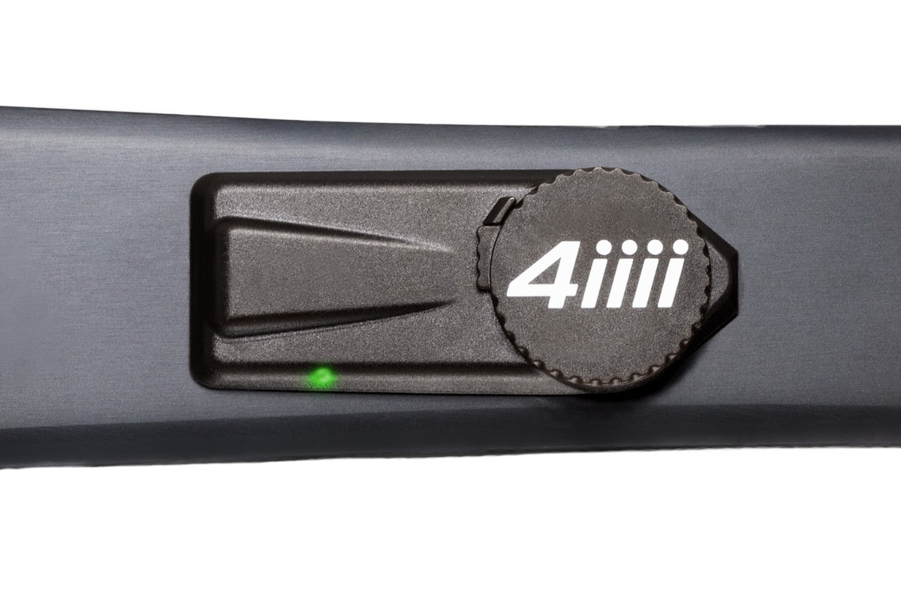

最近在考虑选购一款公路车功率计，想用功率计的原因主要有两点，
一是在路骑的时候更好地控制训练强度，科学训练；二是在爬坡的时候控制爬坡的强度，科学分配体力，避免在爬一些长陡坡的时候用力过猛，导致后面的路程体力不支。
在这里记录一下个人选购功率计的过程，以及需要注意的点。

{/* truncate */}

目前常见的功率计，可以按照应力计安装位置的不同分为三种类型，分别是曲柄式、脚踏式和盘爪式。

### 1. 曲柄式 (Crank-based)

现在市场上常见的*贴片式功率计*和*曲柄功率计*可以归为这一种，它们通过测量曲柄的形变量来测量功率。

优点是贴片式安装简单，不需要考虑太多规格，并且贴片式的功率计制造门槛低，**价格便宜**，是三种类型的功率计中价格最低的。

缺点是测量值不够精确，经常会出现功率值跳动的情况，当然也有好的曲柄功率计，比如 [**4iiii** _Precision 3rd generation_](https://4iiii.com/precision-3/)，官方称准确率可以维持在 +/-1%。

### 2. 脚踏式 (Pedal)

通过测量脚踏上的力来测量功率。

优点是安装拆卸非常方便，随装随用，可以方便地拆卸下来在其它车上使用，并且脚踏式功率计通常还可以测量踩踏过程中的发力方向等，特别是佳明的脚踏式功率计，有非常丰富的数据类型。

缺点是制造工艺难度高，价格通常比较昂贵，并且由于安装位置，在摔车的时候比较容易损坏。

### 3. 盘爪式 (Spider)

通过测量曲柄到齿片上的力来测量功率。

优点是功率测量值较为精确，并且安装位置隐蔽，不容易在摔车的时候损坏。

缺点是安装比较麻烦，涉及到的规格比较多。
